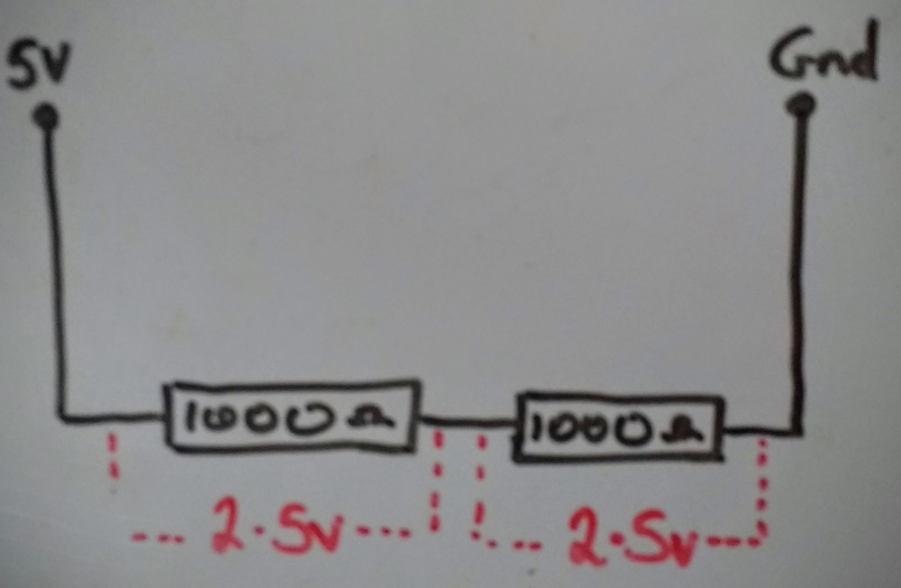
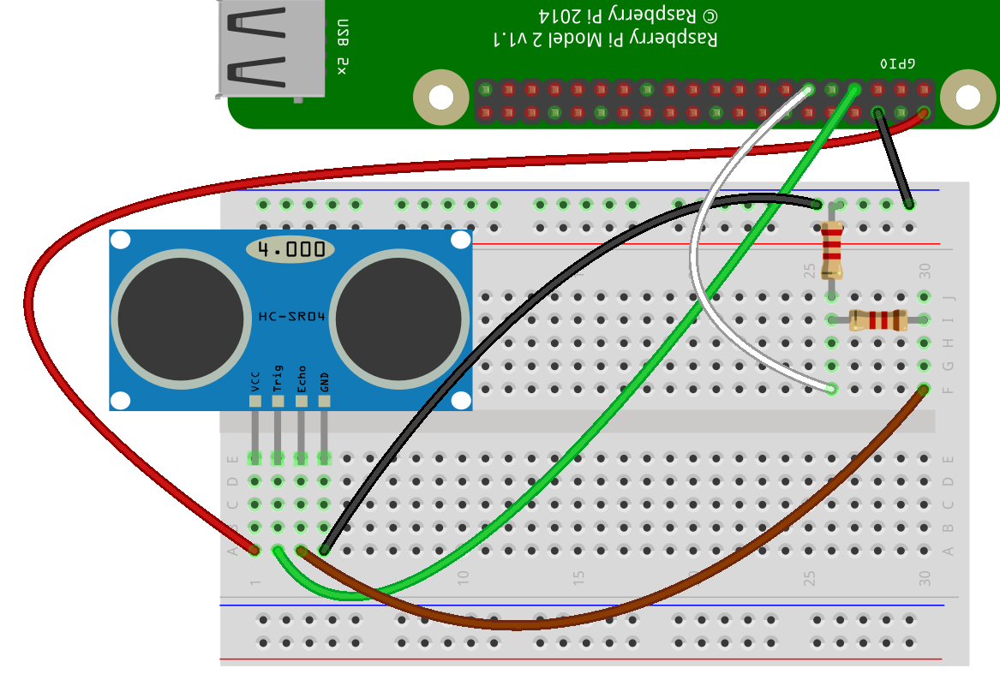

# See like a bat

In this resource you're going to make your very own echolocation system, allowing you to _see_ in the dark.

## Adding _flying leads_ to the vibration motor.

Chances are that the vibration motor you have purchased (or scavenged) will have a pair of _very_ short leads running from it. So te first thing you need to do is to attach some longer leads. This is easiest carried out by using a soldering iron, although you may get away with twisting the wires together and securing them with lots of insulating tape.

1. Take your vibration motor and secure it in place.

1. Use the tip of your soldering iron to heat up the ends of the leads, coming from the soldering iron and then apply a little solder to both leads, so they become coated in the solder. This is known as tinning.

1. Take about 60cm of red and black multicore wire, and strip the insulating plastic from the ends of each.

1. Now tin the ends of your multicore wire.

1. Secure your vibration motor once again, then touch the leads to the multicore wire and apply a little heat to melt the solder they are tinned with. They should join together and form a secure bond.

1. Use some insulating tape or heat-shrink to wrap both wires.

## Testing the vibration motor.

You're now going to need to test your soldering (or twisting).

1. Twist the free ends of the multicore wire so they become fairly rigit.

1. Insert these ends into female-female jumper leads.

1. Place the red lead into the 3V3 output on your Raspberry Pi

1. Place the black lead into any Gnd pin.

_It is important to note that you can only do this with this particular motor, as it has such a small current draw. Larger motors should never be attached directly to the pins on your Raspberry Pi, and should instead by attached to a motor-driver or a transistor._

The motor should start vibrating, at which point you can disconnect it from your Raspberry Pi.

## How an Ultrasonic distance sensor works

An Ultrasonic distance sensor works using ultrasound. This is sound with a frequency so high, that humans are unable to hear it. Bats and Dolphins would have no problems though, as they have evolved to be able to use sounds of this frequency.

The Ultrasonic distance sensor works by sending out a burst of ultrasound. This sound will travel through air, but reflect back (echo) off hard surfaces. The sensor can detect the echo, when it returns.

By knowing the time between burst and echo, and the speed of sound, you can calculate the distance an object is away from the sensor.

An Ultrasonic distance sensor has 4 pins.

```
Vcc is the pin that powers the device. It needs 5V to work.
Trig is the pin that sends out the burst. It can be triggered using 3.3V.
Echo is the pin that outputs when the reflectd sound is received. It outputs at 5V.
Gnd is the ground pin, used to complete the circuit.
```

Here we have a problem. The Echo pin is going to output 5V, but your Raspberry Pi can only receive a maximum of 3.3V through any of the GPIO pins. So inorder not to fry the Pi, you're going to have to reduce that output voltage.

## Potential Dividers.

1. A potential divider can split a voltage into two smaller voltages. It does this by using resistors.
1. Look at the diagram below. It shows a singal resistor connected to 5V. The voltage across the resistor is 5V

1. Now look at this diagram. By using two resitors, the voltage can be split. As both resistors are the same, the voltage is split equally between the two.

1. By altering the resistors, we can taylor the voltage across any one of them to be anything we like.
1. Here you can see that we have split the voltage to give us almost exactly 3.3V

1. To work out the resistors you need, you can use the code below. Or you can just use the resistances in the rest of this guide.

```python
R1 = 1200 # The smaller of the two resistors (alter this)
Vout = 3.3 # The voltage you are trying to achieve (always 3.3)
Vin = 5 # The input voltage (alway 5)

R2 = (Vout * R1) / (Vin - Vout) 

print('The resistor you need is approximately',R2)
```

The resistor needed is only a rough guide. (Remember we actually only need a voltage above 1.8V to get a logical high on a GPIO pin).

## Wiring the Ultrasonic Distance Sensor (USD).

1. The next stage is to set up and test the Ultrasonic Distance Sensor (UDS). This is best done with the Raspberry Pi switched off, as you're about to use 5V, and if you accidently short the Pi, you might have issues.

1. You can start by connecting the 5V pin on the Pi, into the VCC pin on the UDS.
1. The Trig pin on the UDS, can go straight into GPIO 4.
1. The Echo pin on the UDS needs to go to your first resistor of the potential divider.
1. The output of the first resistor of the potential divider needs to go into GPIO 17.
1. The Gnd from the UDS, can go into any Ground pin on the Raspberry Pi.

The diagram below show you the complete setup.



## Testing the Ultrasonic Distance Sensor.
1. You now need to make sure the USD is working correctly.
1. You'll need a little bit of Python 3 code to do this, so open up IDLE and create a new file called bat.py
1. You're going to use gpiozero to code this, but the ultrasonic distance sensor isn't in the library yet. Not to worry though, you can use the default InputDevice and OutputDevice intead.

	```python
	from gpiozero import InputDevice, OutputDevice
	from time import sleep, time
	```

1. Next you can setup the trigger and echo pins of the distance sensor.

	```python
	trig = OutputDevice(4)
	echo = InputDevice(17)

    sleep(2)
	```

1. The `sleep(2)` is there to let the sensor settle itself when the program starts.
1. You can create a function to send and receive a pulse next. The first thing to do is set the trigger pin to send out a burst of ultrasound for 10μs.

	```python
	def get_pulse_time():
	   trig.on()
	   sleep(0.00001)
	   trig.off()
	```
1. As soon as the ultrasonic sensor has sent out a burst of sound, the echo pin is set to `high`. You can use a `while` loop to detect when this happens and then record the current time.

	```python
		while echo.is_active == False:
			pulse_start = time()

	```

1. When an echo is received the echo pin is set to `low`. Another `while` loop will be able to record the time at which it happens.

	```python
		while echo.is_active == True:
			pulse_end = time()

	```

1. Next you need to let the ultra sonic sleep for a little bit, and then return the length of time it took for the pulse to be sent and received.

	```python
		sleep(0.06)

		return pulse_end - pulse_start
	```
1. To finish off you can test the program by running it and then typing the following in the _interpreter_

	```python
	print(get_pulse_time())

	```

1. Try typing it when your hand is close and far from the distance sensor. You should get smaller values as your hand approaches the sensor.

## Calculating the distance

1. There is a simple formula for calculating the distance the sensor is from an object. You can start off with the speed equation.

	

1. This can be rearanged to make:

	

1. But you need to remember that as the sound has to travel to the object and back again, we need to divide the calculated distance by 2. Therefore:

	

1. The speed of sound in air will vary depending on the temperature and air pressure, but it tends to hover around 343ms<sup>-2</sup>.

1. We can write a simple python function to calculate this for us:

	```python
	def calculate_distance(duration):
		speed = 343
		distance = speed * duration / 2 # calculate distance in metres
		return distance
		```
1. Now to test it's all working we can add an infinite loop at the bottom of the script. You full code listing should now look like this:

	```python
	from gpiozero import InputDevice, OutputDevice
	from time import sleep, time

	trig = OutputDevice(4)
	echo = InputDevice(17)

	sleep(2)

	def get_pulse_time():
		trig.on()
		sleep(0.00001)
		trig.off()

		while echo.is_active == False:
			pulse_start = time()

		while echo.is_active == True:
			pulse_end = time()

		sleep(0.06)

		return pulse_end - pulse_start

	def calculate_distance(duration):
		speed = 343
		distance = speed * duration / 2
		return distance

	while True:
		duration = get_pulse_time()
		distance = calculate_distance(duration)
		print(distance)

    ```
1. Run your code and you should see a stream of numbers, showing you the distance from the sensor in metres. Move your hand closer and further from the distance sensor.
